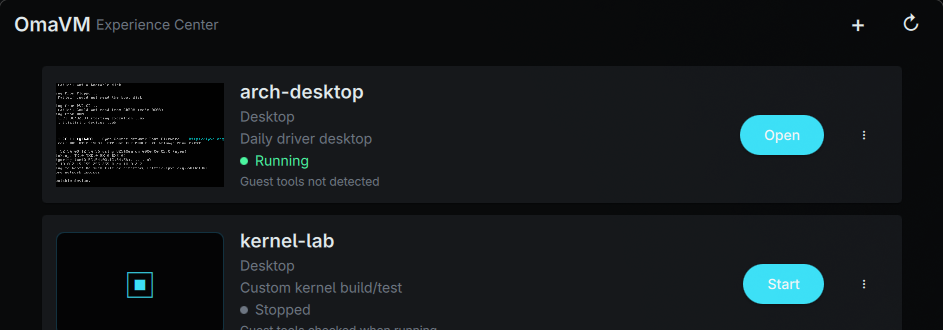

# OmaVM

**A Parallels-style Environment manager for [Omarchy](https://omarchy.org).**

Stop thinking in QEMU, Distrobox, Podman, or virtio. Think in
**Environments**: pick a distro, pick "Development Box" or "Desktop", and
go. OmaVM handles the container/VM plumbing behind a coherent product
model and a UI that looks and feels native to Omarchy's Hyprland desktop.

[](https://github.com/KitsuneSemCalda/OmaVM/actions/workflows/ci.yml)
[](LICENSE)
[](go.mod)



## Why OmaVM

Every other tool in this space makes you pick your battles up front:
`virt-manager` hands you raw libvirt/QEMU knobs, `distrobox` is a
fantastic CLI with no product story around it, and generic VM managers
don't know Omarchy exists. OmaVM's bet, borrowed straight from Parallels
Desktop's philosophy, is that **virtualization should disappear behind
the experience**:

- **One model, two kinds.** An `Environment` is either a **Box**
  (userspace Linux sharing the host kernel, via Distrobox) or a
  **Machine** (its own kernel, via QEMU/KVM). You never pick a backend —
  you pick what you're actually trying to run, and OmaVM resolves it to
  the right one. Linux doesn't automatically mean "container": a custom
  kernel or a from-scratch OS install becomes a Machine, on purpose.
- **Isolation is never hidden.** A Box shares the host kernel; a Machine
  doesn't. That difference is real and OmaVM always says so — no "secure
  sandbox" marketing over a container.
- **A real display, not a bolted-on one.** Machines run fully headless
  QEMU with GPU-accelerated `virtio-vga-gl`, and `omavm-gui` speaks VNC
  natively (a from-scratch client, no external viewer to install) to show
  and control them — fullscreen, on their own workspace if you want.
- **Built for Hyprland/Omarchy, not ported to it.** The GUI is Qt
  Quick/QML, follows your live Omarchy theme (dark/light, accent,
  background — no separate theme system), tiles like every other Omarchy
  window, and ships a Quickshell bar widget.
- **Agent- and script-friendly by construction.** Every capability that
  exists in the GUI exists in the `omavm` CLI first, with `--json` output
  wherever it matters. Nothing is GUI-only.

See [CLAUDE.md](CLAUDE.md) for the full product model, architecture, and
the ground rules this project holds itself to.

## Status

Phase 1 vertical slice, actively developed: Core domain + CLI + GUI, with
a Distrobox-based Development Box backend and a QEMU/KVM Machine backend
implementing Create/Start/Open/Stop/Status/Remove (plus Exec for Boxes,
and Pause/Resume/Restart/ForceStop for Machines). Not yet 1.0 — expect
sharp edges, and see the Non-Goals in CLAUDE.md for what's deliberately
not built yet.

## Quick start

```bash
git clone https://github.com/KitsuneSemCalda/OmaVM.git
cd OmaVM
make check      # build, vet, test everything
make install    # omavm + omavm-gui on PATH, .desktop entry, no root needed
```

```bash
# A Development Box: a fast, integrated Linux userspace.
omavm create --name radic --kind box --image fedora:latest
omavm start radic
omavm exec radic -- go test ./...

# A Machine: its own kernel, its own graphical display.
omavm create --name kernels --kind machine --image /path/to/install.iso
omavm start kernels
omavm open kernels     # opens omavm-gui's built-in VNC viewer
```

Or skip the CLI entirely and use the GUI (`make run-gui`): pick a distro,
pick Development Box or Desktop, done.

## Requirements

| For | Needs |
|---|---|
| Build | Go, Qt 6 Base/Declarative, `qmake6` |
| Boxes | `distrobox` + `podman` (preferred) or `docker` |
| Machines | `qemu-img`/`qemu-system-x86_64` with `/dev/kvm` access |
| Shared folders (Machines) | `virtiofsd` |

Opening a Machine's display needs nothing extra — the viewer is built
into `omavm-gui`. See [Machines](#machines) below for what that gets you.

## Build

```bash
make check   # gofmt, go vet, go test, Go CLI build, and Qt GUI build
```

Or invoke the pieces directly: `make build`, `make test`, `make vet`,
`make fmt`, `make fmt-check`. See the [Makefile](Makefile). CI
(`.github/workflows/ci.yml`) runs the same checks on every push/PR.

## Usage reference

```bash
bin/omavm create --name radic --kind box --image fedora:latest
bin/omavm start radic
bin/omavm exec radic -- go test ./...
bin/omavm status radic
bin/omavm stop radic
bin/omavm rm radic

bin/omavm create --name kernels --kind machine --image /path/to/install.iso
bin/omavm start kernels
bin/omavm status kernels
bin/omavm pause kernels
bin/omavm resume kernels
bin/omavm restart kernels
bin/omavm integration kernels
bin/omavm settings kernels --description "Kernel lab" --cpus 4 --memory-mib 4096
bin/omavm settings kernels --shared-path "$HOME/Projects" --shared-read-only
```

Machines expose the folder to the guest as the virtiofs tag `omavm-share`;
inside a Linux guest, mount it with `mount -t virtiofs omavm-share /mnt/omavm-share`.

`list` and `status` accept `--json` (in any position, e.g. both
`omavm list --json` and `omavm status radic --json` work) for
structured output aimed at agents, scripts, and the Quickshell bar
widget below.

## Machines

Opening a Machine's graphical display launches `omavm-gui` in its built-in
VNC viewer mode (`omavm-gui --viewer <socket> --title <name>`) — no
external VNC/SPICE client to install. Machines run fully headless
(`-display egl-headless`, GPU-accelerated `virtio-vga-gl`) and expose the
display over a local-only VNC Unix socket, plus PipeWire audio and virtiofs
shared folders. There's no automatic host↔guest clipboard yet (that rode on
SPICE's vdagent channel before; VNC's own clipboard extension isn't wired up
— see CLAUDE.md's Current Priorities for the trade-off).

By default the viewer opens as an ordinary window wherever Hyprland
would place it. To always have it open fullscreen on its own dedicated
workspace instead, add this to your own Hyprland config (e.g.
`~/.config/hypr/windows.lua`):

```lua
require("omavm-viewer") -- with contrib/hypr/ on Hyprland's Lua package.path,
                        -- or copy contrib/hypr/omavm-viewer.lua in directly
```

This is optional and never enabled automatically — see
[contrib/hypr/omavm-viewer.lua](contrib/hypr/omavm-viewer.lua).

## GUI (Experience Center)

```bash
make run-gui
```

Environments appear as cards (name, kind, image, status) with Start,
Open, Stop and Delete actions — no backend/infrastructure detail is
exposed. Creating one asks "what do you want to run?", not "which
backend?": pick a distro (or a custom Linux image, or a boot ISO for a
non-Linux system) and, for Linux, whether you want a Development
Environment (Box) or a Virtual Machine (Machine).

Install the `omavm` CLI binary alongside `omavm-gui` (same directory or
on `PATH`) so a Box's "Open" can attach an interactive shell in your
terminal.

A running Machine's card shows a live screenshot of its display
(captured via QEMU's QMP `screendump`, refreshed on every action or
manual Refresh); a Box's card honestly says it has no display to
preview instead of showing a placeholder that pretends otherwise. The
window itself is responsive — the card grid adapts as it narrows instead
of clipping.

Errors and lifecycle events (created/removed) also surface as native
desktop notifications, not just in-window toasts, so they're visible
even if the window isn't focused.

## Install (app launcher entry, icon, PATH)

```bash
make install     # installs to ~/.local/{bin,share/...}, no root needed
make uninstall
```

This puts `omavm`/`omavm-gui` on `PATH` and registers a `.desktop` entry
+ icon so OmaVM shows up in the app launcher and taskbar like any other
Omarchy app. Set `PREFIX=/usr/local` (with `sudo`) for a system-wide
install instead.

## Logs

Both binaries log structured (JSON) events. `/var/log` is root-owned by
default, and OmaVM never escalates privileges silently to write there
(see CLAUDE.md's Security Model), so logging goes to
`/var/log/omavm/<component>.log` only if that directory already exists
and is writable; otherwise it falls back to
`$XDG_STATE_HOME/omavm/logs/<component>.log` (usually
`~/.local/state/omavm/logs/`). The very first log line always records
which path is in effect.

To opt into the system location instead, provision it once yourself:

```bash
sudo install -d -o "$USER" -g "$USER" -m 0755 /var/log/omavm
```

## Omarchy desktop shell (Quickshell bar widget)

Omarchy's desktop (`omarchy-shell`) is a plugin-based Quickshell
instance — see `/usr/share/omarchy/shell/README.md` on an Omarchy
machine. [`contrib/dev.omavm.bar`](contrib/dev.omavm.bar) is a bar-widget
plugin: it shells out to `omavm list --json` to show how many
environments exist, and clicking it launches `omavm-gui`.

```bash
make install-quickshell-plugin
```

This only copies the plugin into `~/.config/omarchy/plugins/`; it does
**not** auto-enable it. Per Omarchy's own plugin trust model (plugins run
unsandboxed inside the already-live shell), review the QML yourself and
then run the two commands the target prints
(`omarchy-shell shell rescanPlugins && omarchy plugin enable dev.omavm.bar`).
See [contrib/dev.omavm.bar/README.md](contrib/dev.omavm.bar/README.md)
for interactions and settings.

## Hyprland

No window rule is shipped for the main window on purpose: it tiles like
any other Omarchy app, which is the native experience on a tiling
compositor — floating it would work against Hyprland, not with it. If
you want a keybinding to open the Experience Center, add one yourself
(not applied automatically — it's your config):

```conf
bind = SUPER, V, exec, omavm-gui
```

## Contributing

Issues and PRs welcome. [CLAUDE.md](CLAUDE.md) is this project's technical
and product constitution — read it first, especially the Non-Goals and
"Rules for AI Agents" sections, before proposing new backends,
abstractions, or big features. Small, focused changes that fit the
existing domain model are the fastest path to a merge.

## License

[MIT](LICENSE)
